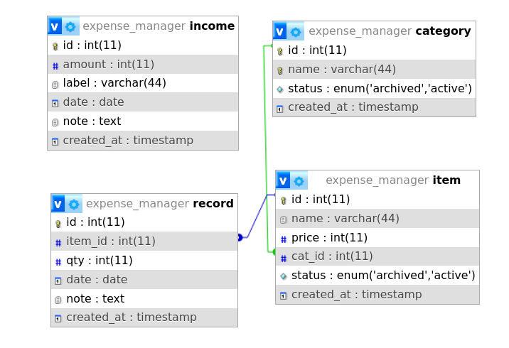
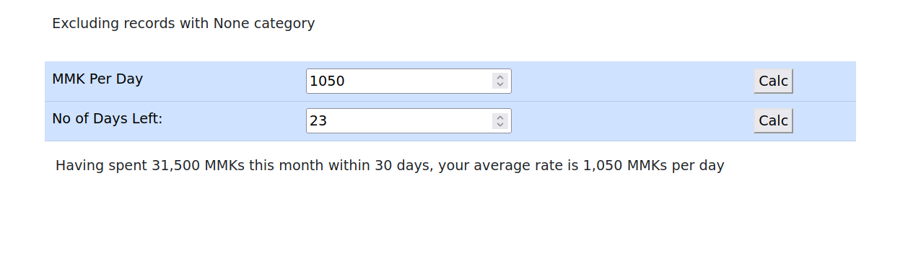
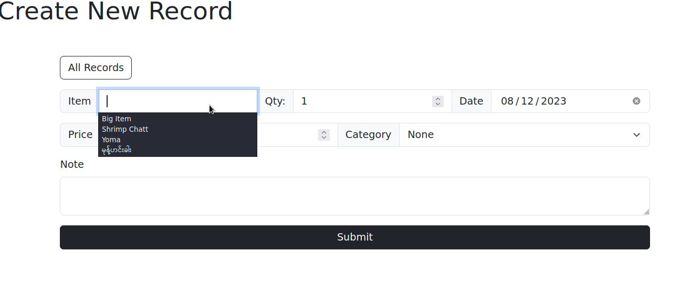
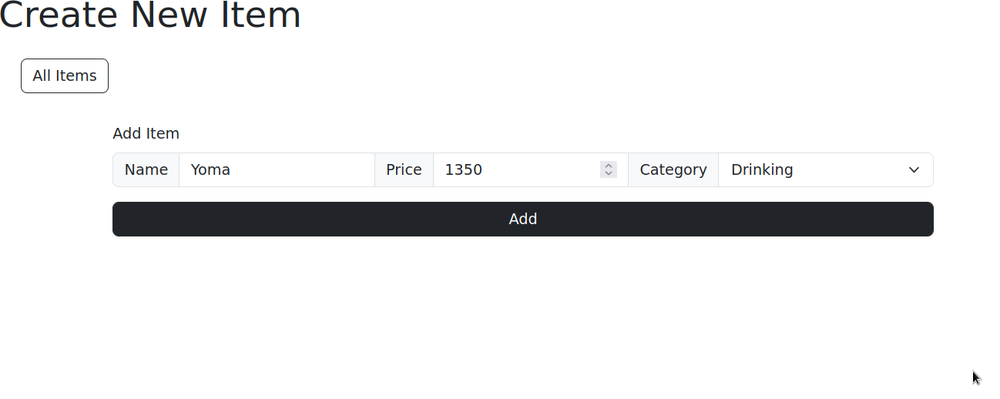
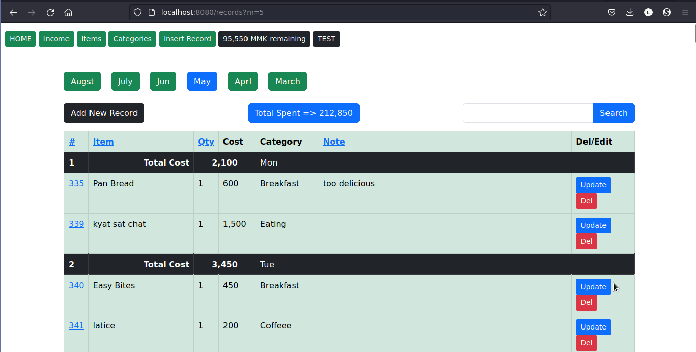

> Loosely built using MVC architecture in pure PHP

### ER Diagram


### try me
```bash
mysql -u root <migrate.sql
cd public
php -S localhost:8080
```

### features
- Keep daily expense records with category, notes, price
- Implement routing
- Use a custom sanitize function to protect XSS attacks
- Remember items that have been recorded to use in the future
- Show the remaining balance, calculate the average rate, monthly outcome

### Screenshots



